## 반려동물과 함께 만들어 가는 나의 이야기 펫토리

# 2조 펫토리

|  |  |  |  |  | |
|:---:|:---:|:---:|:---:|:---:|:---:|
| 김지민 | 박지훈 | 이은서 | 연건창 | 한동주 | 황희순
|산책모임|공동구매|회원프로필 및 기타 기능|상담|게시판|채팅|

## 피그마 링크

-
    [피그마](https://www.figma.com/design/xHsWy8FOgeCmCMxA1W3EFK/Pettory?node-id=258-16373&node-type=frame&t=kA2v01Ccj4yhCz7Y-0)
    

  
## 기능 명세서

  
기능 명세서

  

### 채팅

 

   
채팅

   

- 채팅
    
    ## 채팅 조회 기능
    
    - 입력 된 채팅을 조회할 수 있다.
    
    
    
    ## 채팅 입력 기능
    
    - 채팅을 입력한 후 입력된 채팅을 조회할 수 있다.
    
    
    
    
    

    
   

### 유저

 

   
유저

   

- 유저
    
    ## 유저 로그인
    
    - 로그인 할 수 있는 화면이다.
    
    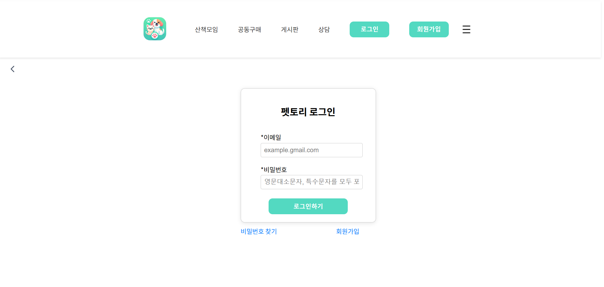
    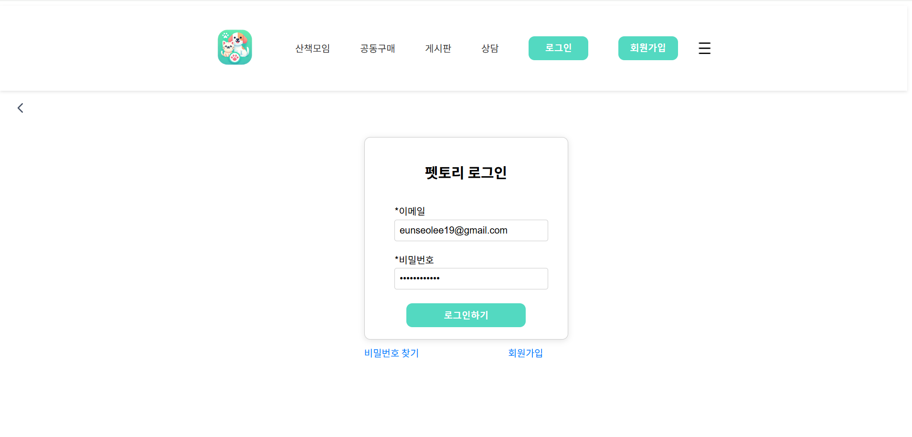
    
    ## 유저 회원가입
    
    - 회원가입을 할 수 있는 화면이다.
    
    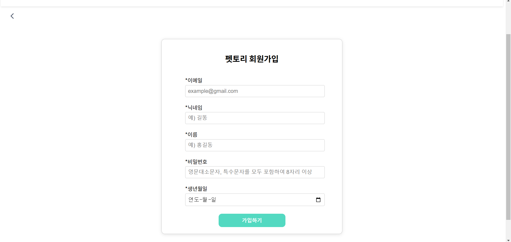
    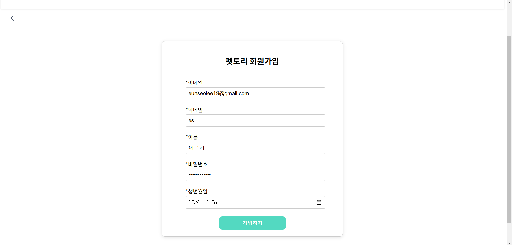

    ## 유저 회원가입 인증
    
    - 회원가입시 인증을 할 수 있는 화면이다.
    
    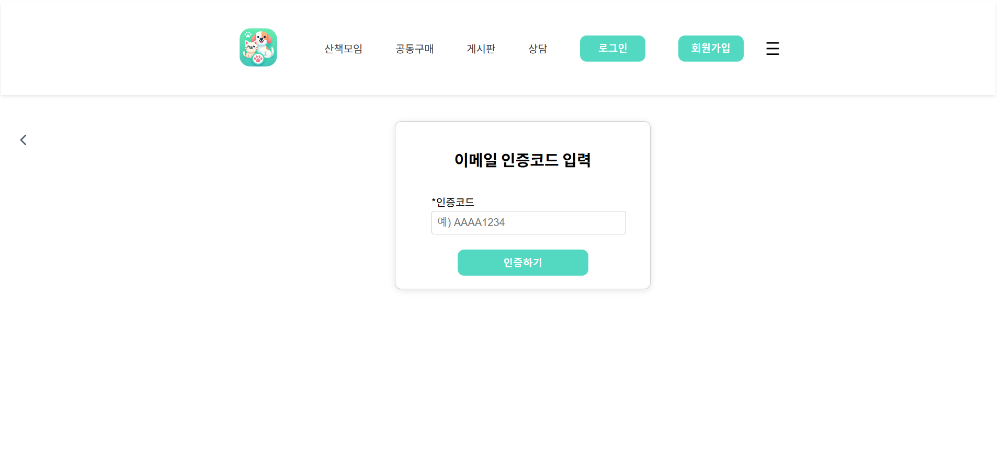
    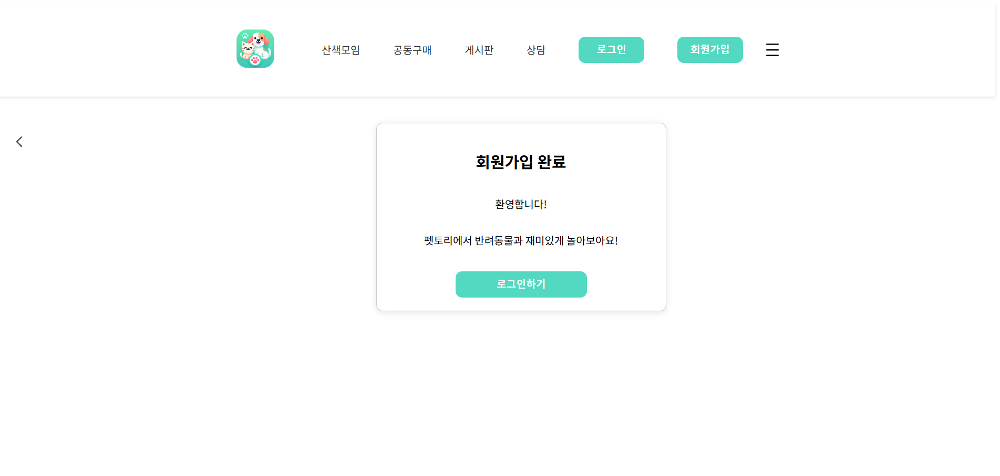

    ## 유저 정보 조회
    
    - 유저 프로필을 조회할 수 있는 화면이다.
    
    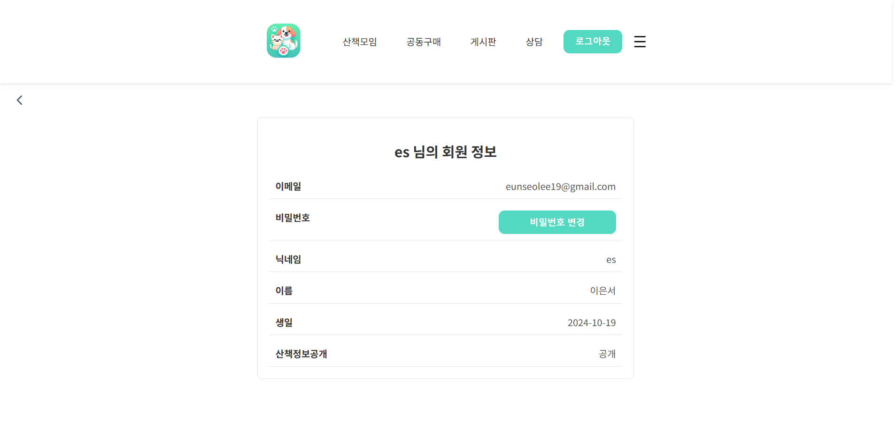

    ## 비밀번호 찾기
    
    - 비밀번호를 찾을 수 있는 화면이다.
    
    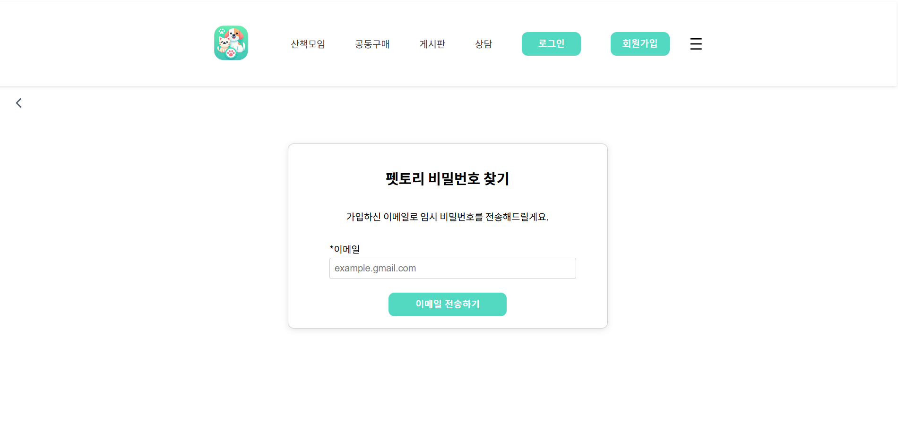

    ## 비밀번호 변경
    
    - 비밀번호를 변경할 수 있는 화면이다.
    
    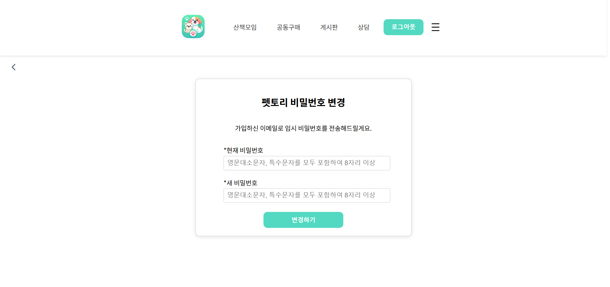

    ## 헤더
    
    - 사이트의 헤더 화면이다.
    
    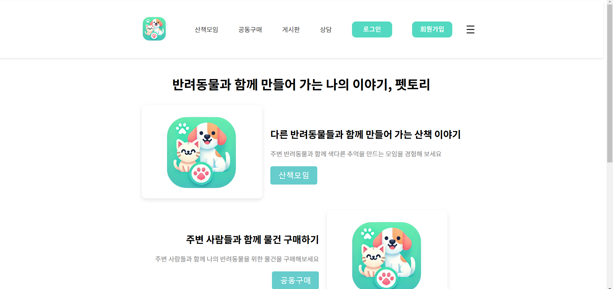

    ## 사이드 바
    
    - 사이트의 사이드 바이다.
    
    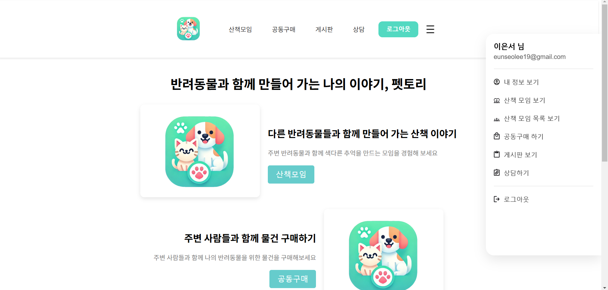
    
    
    

    
   

### 게시판

 

   
게시판

   

- 게시판
    
    ## 게시글 조회
    
    - 게시글 내용을 조회할 수 있는 화면이다.
    
    
    
    ## 게시글 댓글
    
    - 게시글 댓글을 조회할 수 있는 화면이다.
    
    

    ## 게시글 작성
    
    - 게시글을 작성할 수 있는 화면이다.
    
    
    

    ## 카테고리 메인
    
    - 카테고리 목록을 조회,수정,삭제,생성 할 수 있는 화면이다.
    
    
    
    

    
   

### 공동구매

 

   
공동구매

   

- 공동구매
    
    ## 모임방 목록
    
    - 모임방 목록을 확인할 수 있는 화면이다.
    
    
    
    ## 모임방 화면
    
    - 모임방 세부 내용을 확인할 수 있는 화면이다.
    
    

    ## 모임방 생성
    
    - 모임방을 생성할 수 있는 화면이다.
    
    
    

    ## 모임방 수정 
    
    - 모임방을 수정 할 수 있는 화면이다.
    
    

    ## 공동구매 참가
    
    - 공동구매에 참가할 수 있는 화면이다.
    
    

    
    

    
   

### 산책모임

 

   
산책모임

   

- 산책모임
    
    ## 산책 모임 목록
    
    - 산책 모임 목록을 확인할 수 있는 화면이다.
    
    
    
    ## 산책 모임 생성
    
    - 산책 모임을 생성할 수 있는 화면이다.
    
    
 
    

    
   

### 상담

 

   
상담

   

- 상담
    
    ## 상담 목록
    
    - 상담 목록을 확인할 수 있는 화면이다.
    
    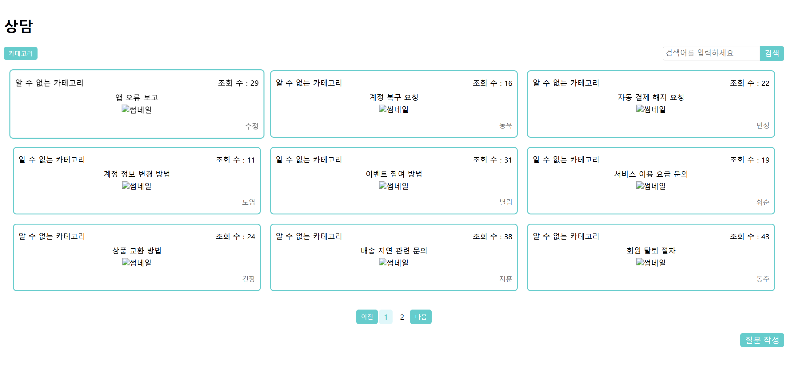
    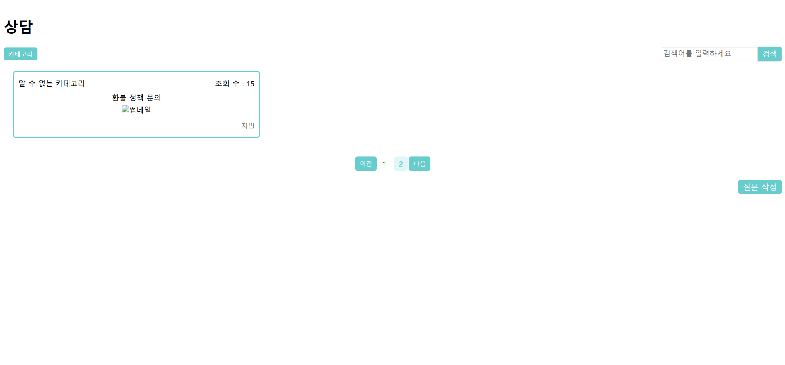
    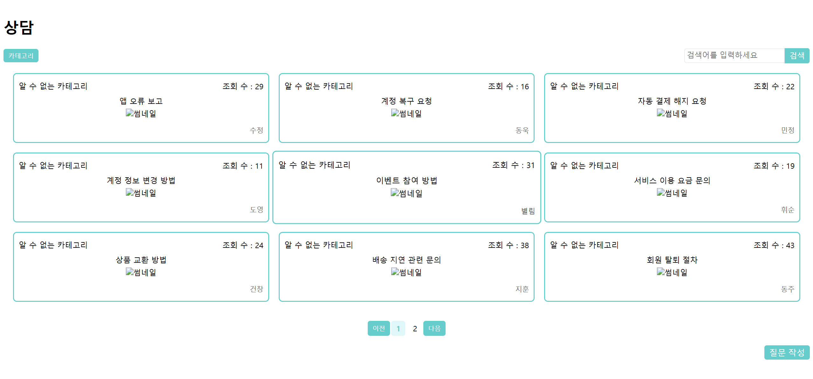
    
    ## 상담 상세 조회
    
    - 상담 내용을 상세 조회 할 수 있는 화면이다.
    
    

     ## 상담 검색
    
    - 상담 제목을 검색할 수 있는 화면이다.
    
    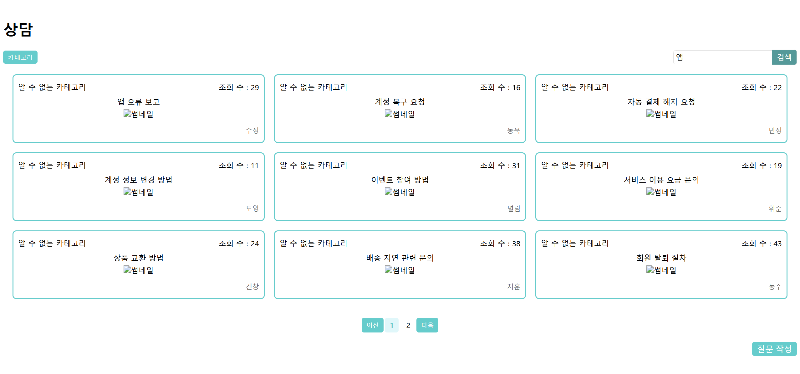

     ## 상담 답변 작성
    
    - 상담 답변을 작성할 수 있는 화면이다.
    
    
    

     ## 상담 재답변 작성
    
    - 상담 재답변을 작성할 수 있는 화면이다.
    
    

     ## 상담 카테고리
    
    - 상담 카테고리를 조회할 수 있는 화면이다.
    
    

     ## 상담 질문 작성

    - 상담 질문을 작성할 수 있는 화면이다.
    
    

     ## 상담 질문 수정
    
    - 상담 질문을 수정할 수 있는 화면이다.
    
    

     ## 상담 질문 삭제
    
    - 상담 질문을 수정할 수 있는 화면이다.
    
    
 
    

    
   

 

## 테스트 결과 보고서

  
테스트 결과

  

### 채팅

 

   
채팅

   

- 채팅
    
    ## 채팅 방 생성 기능
    
    - 채팅 방 생성에 관한 기능을 영상으로 설명 첨부하였음
  - -
    [채팅 설명 영상](https://www.youtube.com/watch?v=ltngrBQs1Bk)
    https://www.youtube.com/watch?v=ltngrBQs1Bk

    

    
   
    

### 게시판

 

   
게시판

   

- 게시판
    
    ## 게시글 홈
    
    

    ## 게시글 조회
    
    

    ## 게시글 생성
    
    

    ## 카테고리 조회
    
    

    ## 카테고리 생성
    
    

    ## 카테고리 수정
    
    

    ## 카테고리 삭제
    
    
 
     

    
   
    
### 상담

 

   
게시판

   

- 상담

    ## 상담 목록 조회
    
    

    ## 상담 상세 조회
    
    

    ## 상담 작성
    
    

    
    

    
   
    

### 공동구매

 

   
게시판

   

- 공동구매

    ## 로그인 후 목록 입장
    
    

    ## 즐겨찾기 체크 및 모음 목록 전환
    
    

    ## 공동구매 모임방 참가
    
    

    ## 참가자 목록 조회
    
    

    ## 공동구매 참가
    
    

    ## 공동구매 참가 취소
    
    

    ## 공동구매 모임방 나가기
    
    

    ## 공동구매 모임방 검색
    
    

    ## 공동구매 모임방 자동 마감
    
    

    ## 모임방 강퇴
    
    

    ## 모임방 생성
    
    

    ## 모임방 수정
    
    

    ## 현재 참여한 모임방 바로참가
    
    

    ## 회원 정보보기
    
    

    

    
 

### 산책모임

 

   
산책모임

   

- 산책모임

    ## 산책모임 이동
    
    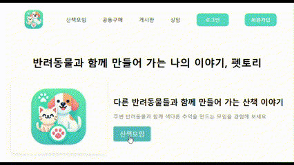

    ## 산책모임 검색
    
    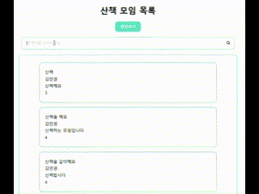

    ## 산책모임 생성
    
    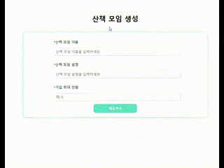

    ## 산책모임 신청
    
    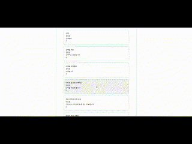

    ## 산책모임 수정
    
    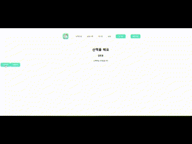

    ## 산책모임 삭제
    
    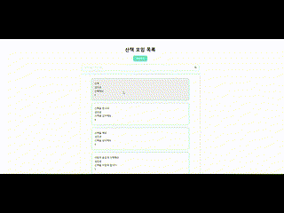

    ## 가입한 산책모임 조회
    
    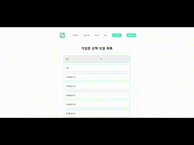

    ## 산책기록 생성
    
    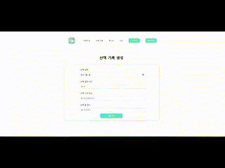

    ## 신청자 조회
    
    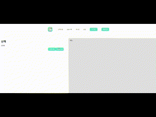

    ## 탈퇴
    
    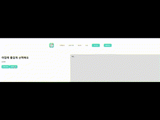

  
    

    
 

### 유저

 

   
유저

   

- 유저

    ## 로그인
    
    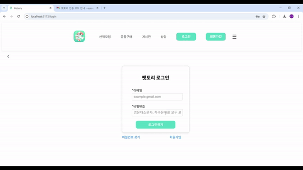

    ## 회원가입
    
    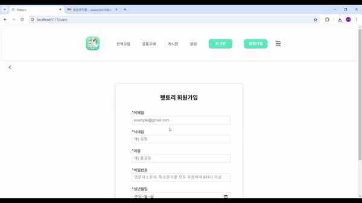

    ## 회원가입 인증
    
    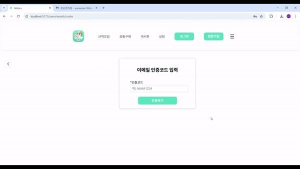

    ## 회원가입 성공
    
    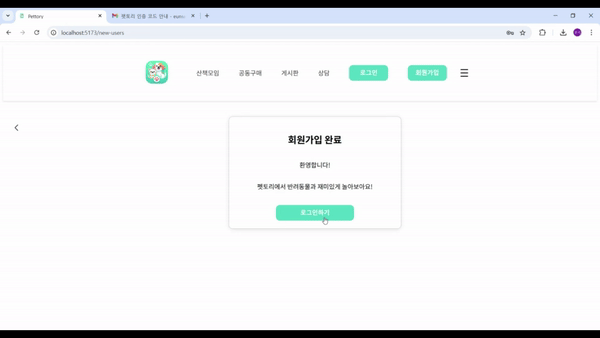

    ## 유저 프로필 조회
    
    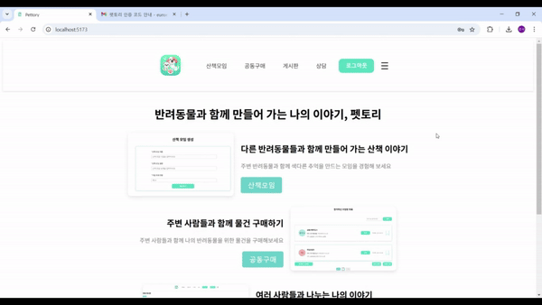

    ## 비밀번호 찾기
    
    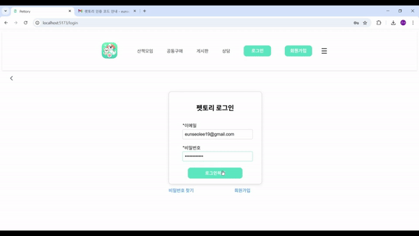

    ## 비밀번호 변경
    
    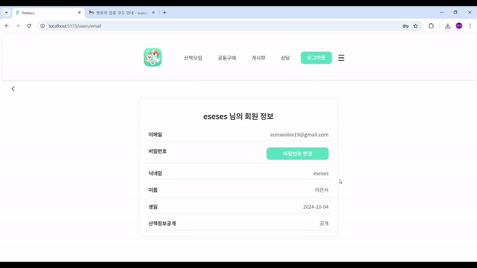
    

    

    
 

  

 

## 팀 회고

|   팀원   | 회고 내용 |
|:---:|-----------|
| 김지민 | 처음 프론트엔드 프로젝트를 할 때에는 비록 ReactNative 이지만 해본 경험이 있기 때문에 백엔드 프로젝트를 하는 것보다는 걱정과 부담이 적었다. 하지만 만만히 볼 것이 아니었고 Vue는 ReactNavtive와 비슷하지만 다른 점도 있기 때문에 힘들었다. 프로젝트를 하는 기간도 짧고 해야할 분량은 많았기에 다급한 마음이 들어 제대로 숙지도 못한 채로 한 것같아 아쉬웠다. 하면 할 수록 백엔드의 수정도 잦았고 프로트엔드를 실행할 때마다 강사님께 질문할 거리도 많았다. 그래도 강사님과 팀원들의 도움으로 할 수 있는 만큼까지는 해볼 수 있었고 다음에 프로젝트를 할 때에는 Vue에 대해 제대로 숙지한 다음에 더 잘 해봐야겠다. |
| 박지훈 | vue.js 을 이용해 예전에 게시판을 간단하게 만든적이 있었는데 그 때는 간단한 기능을 만드는데도 한달 걸리고 이해못한채 진행했던 경험이 있었는데 이번에는 시간은 다소 부족했지만 뭔가 배우고 이해하면서 만들 수 있는 시간이었던 것 같습니다. 백엔드에 이어서 프론트엔드를 진행하다보니 백엔드의 부족함 역시 볼 수 있었던 것 같고, 더 세부적으로 팀원들과 소통하여 이름과 규칙을 정했어야 진행이 빨라졌을 것이다라는 생각이 듭니다. 백엔드 api 를 작성하면서도 기능이 조금 많다고 생각했지만 역시 진행하다보니 생각보다 할 일이 너무 많았고, 결국 완성하지 못한 기능이 많다는 점이 아쉽습니다. 또한 채팅이나 유저 정보는 팀원들의 컴포넌트를 이해해야 사용할 수 있는데 너무 자기 개발만 한 나머지 적용을 못시킨 점이 매우 아쉽습니다. 이 기회를 통해 다음 프로젝트 때는 후회하는 일이 없도록 최선을 다해야 겠다. |
| 이은서 | 로그인, 회원가입, 회원정보 등을 비롯한 회원 관련 기능을 담당했다. 내가 대부분의 기능의 시작점인 로그인 담당이다보니 백엔드 개발 때는 다른 팀원의 api를 들여다 볼 일이 거의 없었는데, 이번에는 화면 구현을 하면서 팀원이 만든 컴포넌트를 가져다 쓸 일이 종종 생겼다. 팀원이 작성한 구조를 카피하기도 하고, 이게 무슨 코드인가 싶어 팀원의 작업을 뒤지다보니 본받고 싶은 점들이 보였다. Spring Security나 Figma 사용법, 민감한 정보 분리하는 법 등을 팀원들에게 알려주기 위해 메뉴얼을 작성해 공유했는데, 내가 잘못된 지식을 알려주면 어쩌나 하고 걱정이 되면서도 무척 뿌듯하고 재미있었다. 백엔드 개발과 마찬가지로, DB나 환경 설정 때문에 자잘하게 귀찮은 일이 많았다. 이래서 Docker를 쓰는구나 싶었다. 잘 모르는 기술이라고 제쳐두지 말고 한 번 고려해볼 걸, 하는 후회가 들었다. 회원 관련 기능을 제외하고도, 백엔드 개발 당시 만들어 놓은 api가 굉장히 많았는데, 스케줄 상 많이 덜어내야 해서 아쉬움이 크다. Figma에서 공들여 만든 디자인 요소들이 반영되지 못한 것도 아깝다. 다음에도 막바지에 다다라서 후회하지 않으려면 순간 순간에 최선을 다해야겠다. |
| 연건창 | 처음으로 프론트엔드와 백엔드를 아우르는 게시판 기능을 구현해 보면서 많은 배움을 얻었습니다. 프론트엔드 프로젝트에 대한 부담이 상대적으로 적었으나, 진행하면서 생각보다 복잡하고 많은 준비가 필요하다는 것을 깨달았습니다. 특히 짧은 프로젝트 기간 동안 다급하게 작업하다 보니 기능을 완성하지 못한 부분과 제대로 숙지하지 못한 채 넘어간 부분들이 아쉬움으로 남았습니다. 백엔드와 프론트엔드의 조화가 제대로 이루어지지 않은 점과 자잘한 환경 설정 문제, Figma에서 공들여 디자인한 요소들이 반영되지 못한 점도 아쉬웠지만, 이를 통해 많은 경험을 얻었습니다. 팀원들과의 소통과 협업, 그리고 구조적인 부분을 명확하게 해야 된다는 중요함을 다시금 느꼈습니다. 비록 기능을 완성하지 못한 부분들이 남았지만, 이번 경험을 발판으로 다음에는 더 빠르고 능숙하게 프로젝트를 완성하겠습니다. 더불어 Vue.js와 팀원들의 코드 구조에 대한 이해가 부족해 종종 작업에 어려움을 겪었지만, 팀원들과 강사님의 도움 덕분에 헤쳐 나갈 수 있었습니다. 다음 프로젝트에서는 순간 순간 최선을 다하고, 배운 내용을 바탕으로 후회 없는 결과물을 만들 수 있도록 더욱 노력하겠습니다. |
| 한동주 | 프론트엔드는 완전히 처음 해보는 부분이라 생소했는데 역시 어려움이 많았습니다. Vue.js를 처음 사용해보며 새로운 경험을 해보는것이 즐거웠지만 완전히 모르는 부분을 진행하다 보니 어려움도 많았던 것 같습니다. 백엔드를 다룰때에는 생각해보지 못한 고충들도 경험해보며 성장하는 시간이 되었던 것 같습니다. 시간이 더 많았다면 더 완전한 작품을 낼 수 있었을것 같다는 아쉬움도 남습니다. 하지만 모르는 부분들은 팀원들이 도와주며 일부분이지만 완성하고 보니 뿌듯한 부분도 있었습니다. 부족한 팀장 따라준 팀원들에게 너무 고맙고 항상 잘 알려주셔서 감사합니다!  |
| 황희순 &nbsp;&nbsp;&nbsp;&nbsp;&nbsp;&nbsp;&nbsp;&nbsp;&nbsp;&nbsp;&nbsp;&nbsp; | 내 생에 처음으로 채팅이라는 실시간 통신이 필요한 기능을 만들게 되었다. 수업에서 강사님께서 주신 자료도 유용했지만 실시간 통신이 들어가야 해서 좀 더 별도의 자료 조사나 GPT 를 활용하여 추가적인 문법이나 지식을 얻어야 했다. 최종적으로 실시간 채팅이 되는 것을 만들었다 하지만 아쉬운 것은 프론트까지 생각한 벡엔드 개발이 충분히 이루어지지 못했고 피그마에 만들어 놓은 채팅 수정과 삭제 기능을 못 했다는 것이 너무 아쉬웠다 하지만 이제 실시간 통신을 할 수 있고 많은 지식들 얻게 되어 다음 번에는 더 빠르고 능숙하게 만들 수 있을 거 같다. |
